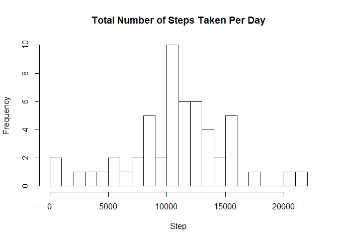
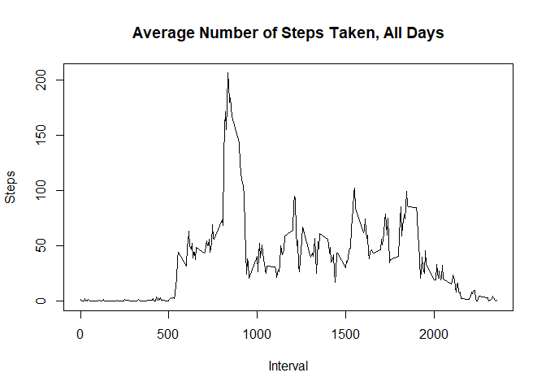
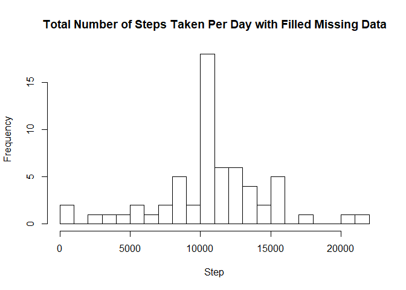
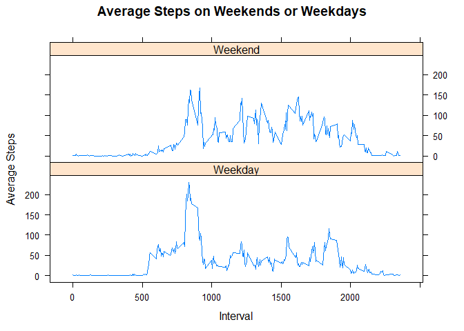

## Loading and preprocessing the data
Using dplyr to manipulate data. Working directory also set. To read the csv file, change the argument in the setwd command to the location of the activity.zip raw data.

```r
library(dplyr)
```

```
## 
## Attaching package: 'dplyr'
```

```
## The following objects are masked from 'package:stats':
## 
##     filter, lag
```

```
## The following objects are masked from 'package:base':
## 
##     intersect, setdiff, setequal, union
```

```r
setwd("C:\\Work\\Data Science\\github\\RepData_PeerAssessment1")
colCl<-c("integer","Date","integer") #Predefine column classes
activityData<-read.csv(unz("activity.zip","activity.csv"),colClasses = colCl)
```

## What is mean total number of steps taken per day?
Calculate the total steps per day, plot into histogram.

```r
per_day<-group_by(activityData,date)  #group by date
per_day_value<-summarize(per_day,total=sum(steps)) #sum all steps per day
head(per_day_value) #The first few values of total steps per day
```

```
## # A tibble: 6 x 2
##   date       total
##   <date>     <int>
## 1 2012-10-01    NA
## 2 2012-10-02   126
## 3 2012-10-03 11352
## 4 2012-10-04 12116
## 5 2012-10-05 13294
## 6 2012-10-06 15420
```

```r
hist(per_day_value$total,breaks = 30,main = "Total Number of Steps Taken Per Day",xlab ="Step",ylab="Frequency")
```

<!-- -->

The mean and median of the total number of steps taken per day:

```r
mean(per_day_value$total,na.rm=TRUE)
```

```
## [1] 10766.19
```

```r
median(per_day_value$total,na.rm=TRUE)
```

```
## [1] 10765
```

## What is the average daily activity pattern?
Make a time series plot of the 5-minute interval (x-axis) and the average number of steps taken, averaged across all days (y-axis)

```r
per_interval<-group_by(activityData,interval) #group data by interval
per_interval_value<-summarize(per_interval,ave=mean(steps,na.rm=TRUE)) #average data by grouped interval
plot(per_interval_value$interval,per_interval_value$ave,type="l",main="Average Number of Steps Taken, All Days",xlab="Interval",ylab="Steps")
```

<!-- -->

The 5-minute interval, on average across all the days in the dataset, which contains the maximum number of step is:

```r
max_index<-which.max(per_interval_value$ave) #gets the index of maximum ave value
per_interval_value[max_index,1]              #returns the maximum value
```

```
## # A tibble: 1 x 1
##   interval
##      <int>
## 1      835
```
## Imputing missing values
Calculating the total number of NAs

```r
sum(is.na(activityData$steps))
```

```
## [1] 2304
```
Im using the average of steps on daily intervals to fill the missing data.

```r
activityDataMod <- activityData
for (i in seq_along(activityDataMod$steps)){    #if value is NA, fill with average daily steps value
    if (is.na(activityDataMod$steps[i])==TRUE){   
        intvl<-activityDataMod$interval[i]        
        int_index<-match(intvl,per_interval_value$interval)  #gets the average value of the interval
        activityDataMod[i,1]<-per_interval_value$ave[int_index] #and replaces the NA
    }
        
}
per_day<-group_by(activityDataMod,date)
per_day_value<-summarize(per_day,total=sum(steps))
hist(per_day_value$total,breaks = 30,main = "Total Number of Steps Taken Per Day with Filled Missing Data",xlab ="Step",ylab="Frequency")
```

<!-- -->

The mean and median of the total number of steps taken per day with no missing data are:

```r
mean(per_day_value$total,na.rm=TRUE)
```

```
## [1] 10766.19
```

```r
median(per_day_value$total,na.rm=TRUE)
```

```
## [1] 10766.19
```
Because the mean values are used to fill in missing data, the overall mean does not change as well. Median values shift to mean value.

## Are there differences in activity patterns between weekdays and weekends?

Create a new data frame with weekdays

```r
activityDataMod$day_of_week<-weekdays(activityDataMod$date)

for (i in seq_along(activityDataMod$day_of_week)){ #assign Weekend or Weekday values
    day<-activityDataMod$day_of_week[i]
    if (day=="Saturday" |day=="Sunday"){
        activityDataMod$day_of_week[i]<-"Weekend"
    } else{
        activityDataMod$day_of_week[i]<-"Weekday"
    }
}

per_interval<-group_by(activityDataMod,interval,day_of_week)
per_interval_value<-summarize(per_interval,mean_steps=mean(steps,na.rm=TRUE))

library(lattice)  #Use lattice for the required multifaceted plot
xyplot(mean_steps~interval|day_of_week, data=per_interval_value,layout=c(1,2),type="l",main = "Average Steps on Weekends or Weekdays",xlab = "Interval",ylab="Average Steps")
```

<!-- -->
